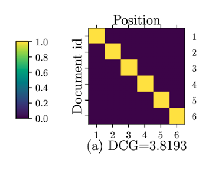
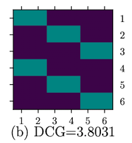
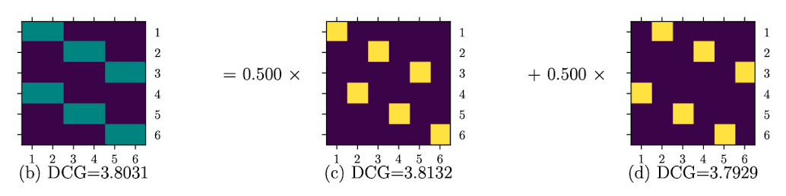
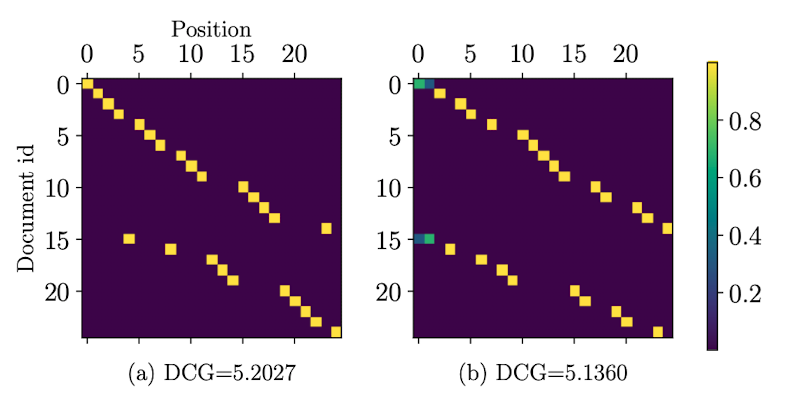

# Introduction of the paper
Today, I'm going to share points and conceptions I got from a fantastic paper "Fairness of Exposure in Rankings[^1]" written by **Ashudeep Singh** and **Thorsten Joachims**.

In this paper, the authors mainly introduce the fairness constraints based on exposure in rankings. They proposed three forms of fairness constraints, namely **demographic parity**, **disparate treatment** and **disparate impact** constraints to balance fairness to the items being ranked with the utility.

## Demographic parity[^2]
**Demographic parity** states that protected groups (based on sensitive attributes, e.g. sex, gender, etc.) should have equal opportunities to be shown or recommended. For example, male and female job seekers should have equal opportunities to expose in a job seeker website. It's reasonable to distribute exposure more evenly, even if sacrificing the utility in rankings.

## Disparate treatment[^2]
**Disparate treatment** is a term refers to a kind of **intentional** discrimination. For example, only testing the particular skills of female applicants in a job seeker website.

## Disparate impact
Unlike disparate treatment, **disparate impact** is referred to unintentional discrimination, for example, female job seekers with a lower proportion of all job seekers would be exposed less unintentionally.

# The framework for fair ranking
As the authors of this paper proposed, the definition of fairness depends on context and application, which means that different fairness constraints should be applied on different scenarios. They developed a general framework for computing utility-maximizing ranking under different fairness constraints. Generally, the problem of optimal ranking under fairness constraints can be formulated as the following optimization problem:
$$
r = \argmax_r U(r|q)
$$
, where $U(r|q)$ denotes the utility of a ranking $r$ for query $q$, the ranking $r$ presents the order of a set of documents $\mathcal{D} = \{d_1, d_2, d_3\dots, d_N\}$.

## Untility
The utility measures of a ranking system evaluates the utility of the ranking from the relevance of the individual items being ranked. $rel(d|u, q)$ denotes the relevance score of the document $d$ when a user $u$ search a query $q$, the relevance could be binary relevance, movie ratings or a real-valued score. In information retrieval systems, the generic way to express utility measures is:
$$
U(r|q) = \sum_{u\in\mathcal{U}}P(u|q)\sum_{d\in\mathcal{D}}v(rank(d|r))\lambda(rel(d|u, q)),
$$
where $\mathcal{U}$ is the set of all users that lead to identical $q$, $v$ reflects the importance of ranking position and $\lambda$ is a function mapping the relevance to its utility. Take Discounted Cumulative Gain (DCG) as an example:
$$
DCG(r|q) = \sum_{u\in\mathcal{U}}P(u|q)\sum_{d\in\mathcal{D}}\frac{2^{rel(d|u,q)} - 1}{log(1 + rank(d|r))},
$$
where $2^{rel(d|u,q)} - 1 = \lambda(rel(d|u,q))$ and $\frac{1}{log(1 + rank(d|r))} = v(rank(d|r))$.

Due to the linear relationship between utility and both $v$ and $\lambda$, the above equation can be reformulated as:
$$
U(r|q) = \sum_{d\in\mathcal{D}}v(rank(d|r))(\sum_{u\in\mathcal{U}}\lambda(rel(d|u,q))P(u|q)) \\
= \sum_{d\in\mathcal{D}}v(rank(d|r))u(d|q)
$$
, where
$$
u(d|q) = \sum_{u\in\mathcal{U}}\lambda(rel(d|u,q))P(u|q)
$$
is the expected utility of a document $d$ for query $q$. $u(d|q)$ can be understood as the probability of relevance if $rel(d|u,q)$ are binary relevances. Therefore, sorting the documents by $u(d|q)$ is the effective way to maximize the utility for ranking:
$$
\argmax_rU(r|q) \equiv \underset{d\in\mathcal{D}}{\mathrm{arg\,sort}}\,u(d|q).
$$
Based on this equation, we can take an example to explain it:

|Document ID | Position  | Binary Relevance Score  |  $v(rank(d\vert r))u(d\vert q)$ |
| ---- | ------------- |:-------------:|:---------:|
| 0 | 1      | 0 | $\frac{2^{0} - 1}{log(1+1)}$ |
| 1 | 2      | 1 | $\frac{2^{1} - 1}{log(1+2)}$ |
| 2 | 3      | 0 | $\frac{2^{0} - 1}{log(1+3)}$ |
| 3 | 4      | 1 | $\frac{2^{1} - 1}{log(1+4)}$ |
| 4 | 5      | 1 | $\frac{2^{1} - 1}{log(1+5)}$ |
| 5 | 6      | 0 | $\frac{2^{0} - 1}{log(1+6)}$ |

We can easily get the best-ranking order by sorting the $v(rank(d\vert r))u(d\vert q)$, the ranking order with maximum utility should be $\{d_1, d_3, d_4, d_0, d_2, d_5\}$.

## Probabilistic Rankings
In this paper, the authors applied probabilistic rankings $R$ instead of a single deterministic ranking $r$ to avoid combinatorial optimization:
$$
U(R|q) = \sum_rR(r)\sum_{u\in\mathcal{U}}P(u|q)\sum_{d\in\mathcal{D}}v(rank(d|r))\lambda(rel(d|u,q)) \\= \sum_rR(r)\sum_{d\in\mathcal{D}}v(rank(d|r))u(d|q)
$$
, to avoid the exponential computation, the authors compute the utility by the marginal rank distributions[^3] of the documents.

Specifically, let $P_{i, j}$ be the probability that $R$ places document $d_i$ at rank $j$, then creating a doubly stochastic matrix[^4] of size $N \times N$ using $P$. The matrix meets:
$$
\sum_iP_{i, j} = \sum_jP_{i, j} = 1
$$
. Therefore, the expected utility for a probabilistic ranking can be computed as:
$$
U(P|q) = \sum_{d_i\in\mathcal{D}}\sum_{j=1}^{N}P_{i,j} u(d_i|q)v(j),
$$
where $u(d_i|q)$ for each user should be a column vector with size of $N$, and $v$ is also a column vector of size $N$. Thus, the expected utility can be rewritten as:
$$
U(P|q) = u^TPv.
$$

## Optimizing Fair Rankings via Linear Programming
To efficiently compute $R$ for every doubly stochastic matrix $P$, they formulated the problem of finding the utility-maximizing probabilistic ranking under fairness constraints in terms of doubly stochastic matrices instead of distributions over rankings:
$$
P = \argmax_P u^TPv \\
(s.t.\, \mathbb{1}^TP = \mathbb{1}^T, P\mathbb{1} = \mathbb{1}, 0 <= P_{i,j} <= 1 ,P\,is\,fair)
$$
The optimization objective is linear in $N^2$ variables $P_{i,j}$ ($1 <= i,j <= N$). And the fairness constraints are linear as well. The solution without fairness constrains and for any $v_j$ that decreases with $j$ is the permutation matrix[^5] that ranks the set of documents in decreasing order of utility. Therefore, the problem of finding the utility-maximizing probabilistic ranking and the fairness constraints can be linearly formulated as:
$$
f^TPg = h.
$$

## Sampling Rankings
The authors employed the Birkhoff-von Neumann(BvN) decomposition[^6] to compute $R$ from $P$. Specifically, if $A$ is a doubly stochastic matrix, the decomposition of the form is:
$$
A = \theta_1A_1 + \theta_2A_2 + ... + \theta_nA_n
$$
where $0 <= \theta_i <= 1$, and $A_i$ are permutation matrices. $A_i$ corresponses to deterministic rankings of the document set and $\theta_i$ corresponds to the probability of sampling each ranking.

The decomposition can be computed efficiently in polynomial time, according to Marcus-Ree theorem[^6], there are no more than $(N-1)^2 + 1$ permutation matrices.

## Summary of Algorithm

>1. Set up the utility vector $u$ and position discount vector $v$, as well as the vectors $f$ and $g$, and $h$.

>2. Solve the linear program for $P$.

>3. Compute the Birkhoff-von Neumann decomposition $P = \theta_1P_1 + \theta_2P_2 + ... + \theta_nP_n$.

>4. Sample permutation matrix $P_i$ with probability proportional to $\theta_i$ and get the corresponding ranking $r_i$.

While setting up the vectors in the first step, $u(d|q)$ is assumed as true relevances and $\hat{u}(d|q)$ is from some predictive models.

# Fairness Constraints
First, to clearly express the fairness, the authors define the exposure for a document $d_i$ under a probabilistic ranking $P$ as:
$$
Exposure(d_i|P) = \sum_{j=1}^{N}P_{i,j}v_j
$$
The goal is to ensure different groups $G_k$ have the same opportunities of exposure.

## Data sets
They employed two data sets, one is the fake synthetic data set which contains 6 job seekers with probabilities of relevance to an employer of $u = (0.81, 0.80, 0.79, 0.78, 0.77, 0.76)^T$ and the other is ***News recommendation dataset*** with ratings divided by 5 and added a Gaussian noise of 0.05 (finally clipped to 0 ~ 1).

## Demographic Parity Constraints
This constraint enforces the average exposure of the documents in both groups is equal, the average exposure in a group is denoted as:
$$
Exposure(G_K|P) = \frac{1}{|G_k|}\sum_{d_i\in G_k}Exposure(d_i|P),
$$
this constraint can be easily expressed as:
$$
Exposure(G_0|P) = Exposure(G_1|P) \\
\Longleftrightarrow \frac{1}{|G_0|}\sum_{d_i\in G_0}\sum_{j=1}^NP_{i,j}v_j = \frac{1}{|G_1|}\sum_{d_i\in G_1}\sum_{j=1}^NP_{i,j}v_j \\
\Longleftrightarrow \sum_{d_i\in \mathcal{D}}\sum_{j=1}^N(\frac{\mathbb{1}_{d_i\in G_0}}{|G_0|} - \frac{\mathbb{1}_{d_i\in G_1}}{|G_1|})P_{i,j}v_j = 0 \\
\Longleftrightarrow f^TPv = 0\,(with\,f_i=\frac{\mathbb{1}_{d_i\in G_0}}{|G_0|} - \frac{\mathbb{1}_{d_i\in G_1}}{|G_1|})
$$

### Experiments
For the data set of Job-seeker, after solving the linear program without fairness constrains, the below figure shows the optimal rankings in terms of $P$. 

The optimal rankings in terms of $P$ with Demographic Parity constraint is shown as the below figure:

This fair ranking can be decomposed into a mixture of two deterministic permutation matrices with the associated weights:

The results are shown by the below figure for the data set News recommendation dataset:

## Disparate Treatment Constraints
This constraint ensure the exposure be proportional to relevance, to end this, the average utility of a group can be denoted as:
$$
U(G_k|P) = \frac{1}{|G_k|}\sum_{d_i\in G_k}u_i,
$$
the exposure of two groups to be proportional to their average utility:
$$
\frac{Exposure(G_0|P)}{U(G_0|q)} = \frac{Exposure(G_1|P)}{U(G_1|q)} \\
\Longleftrightarrow \frac{\frac{1}{|G_0|}\sum_{d_i\in G_0}\sum_{j=1}^{N}P_{i,j}v_j}{U(G_0|q)} = \frac{\frac{1}{|G_1|}\sum_{d_i\in G_1}\sum_{j=1}^{N}P_{i,j}v_j}{U(G_1|q)} \\
\Longleftrightarrow \sum_{i=1}^N\sum_{j=1}^N(\frac{\mathbb{1_{d_i\in G_0}}}{|G_0|U(G_0|q)} - \frac{\mathbb{1_{d_i\in G_1}}}{|G_1|U(G_1|q)})P_{i,j}v_j = 0 \\
\Longleftrightarrow f^TPv = 0\,(with f_i = (\frac{\mathbb{1_{d_i\in G_0}}}{|G_0|U(G_0|q)} - \frac{\mathbb{1_{d_i\in G_1}}}{|G_1|U(G_1|q)})).
$$
To compute how differently the two groups are treated, they defined a measure called Disparate Treatment Ratio (DTR):
$$
DTR(G_0, G_1|P,q) = \frac{Exposure(G_0|P)/U(G_0|q)}{Exposure(G_1|P)/U(G_1|q)}
$$
The results are not going to show here, please find details from the paper[^1].

## Disparate Impact Constraints
For this constraint, they first define the probability of a document getting clicked:
$$
P(click on document i) = P(examining i) \times P(i is relevant) \\
= Exposure(d_i|P) \times P(i is relevant) \\
= (\sum_{j=1}^NP_{i,j}v_j) \times u_i
$$
Then, compute the average clickthrough rate of documents in a group G_k as:
$$
CTR(G_k|P) = \frac{1}{|G_k|}\sum{i\in G_k}\sum_{j=1}^NP_{i,j}u_iv_j.
$$
The Disparate Impact Constraint enforces the expected clickthrough rate of each group is proportional to its average utility:
$$
\frac{CTR(G_0|P)}{U(G_0|q)} = \frac{CTR(G_1|P)}{U(G_1|q)} \\
\Longleftrightarrow \frac{\frac{1}{|G_0|}\sum_{i\in G_0}\sum_{j=1}^NP_{i,j}u_iv_j}{U(G_0|q)} = \frac{\frac{1}{|G_1|}\sum_{i\in G_1}\sum_{j=1}^NP_{i,j}u_iv_j}{U(G_1|q)} \\
\Longleftrightarrow \sum_{i=1}^N\sum_{j=1}^N(\frac{\mathbb{1_{d_i\in G_0}}}{|G_0|U(G_0|q)} - \frac{\mathbb{1_{d_i\in G_1}}}{|G_1|U(G_1|q)})u_iP_{i,j}v_j = 0 \\
\Longleftrightarrow f^TPv = 0\,(with f_i = (\frac{\mathbb{1_{d_i\in G_0}}}{|G_0|U(G_0|q)} - \frac{\mathbb{1_{d_i\in G_1}}}{|G_1|U(G_1|q)})u_i).
$$

Similarly, to measure the extent to which the disparate impact constraint is violated, DIR (Disparate Impact Ratio) is defined as:
$$
DIR(G_0, G_1|P,q) = \frac{CTR(G_0|P)/U(G_0|q)}{CTR(G_1|P)/U(G_1|q)}.
$$

# Conclusion
In this paper, the authors developed a generic probabilistic ranking framework for applying different fairness constraints. The defined three constraints are very clear and clever, which reflects the authors'
solid mathematical skills. 

In this blog article, all main points and logics are summarised, I recommended to read the original paper for the specific details. You are also welcome to discuss here. : D

# References
[^1]: [Fairness of Exposure in Rankings](https://arxiv.org/abs/1802.07281)

[^2]: [What are disparate impact and disparate treatment?](https://www.shrm.org/resourcesandtools/tools-and-samples/hr-qa/pages/disparateimpactdisparatetreatment.aspx)

[^3]: [Marginal distribution](https://en.wikipedia.org/wiki/Marginal_distribution#cite_note-1)

[^4]: [Doubly stochastic matrix](https://en.wikipedia.org/wiki/Doubly_stochastic_matrix#:~:text=In%20mathematics%2C%20especially%20in%20probability,left%20stochastic%20and%20right%20stochastic.)

[^5]: [Permutation matrix](https://en.wikipedia.org/wiki/Permutation_matrix)
