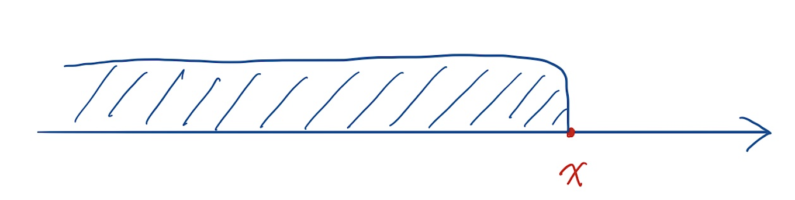
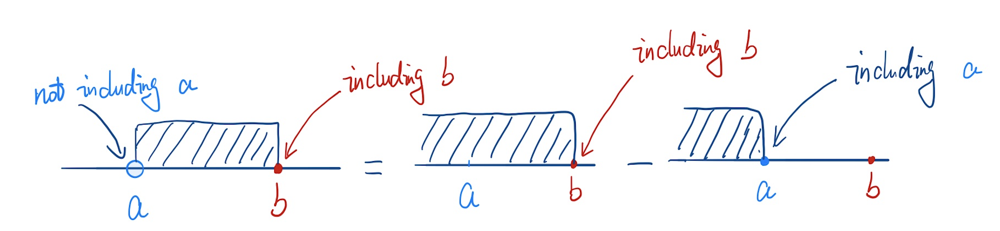

## What is CDF?
CDF is the <b style="color: #A0010F">C</b>umulative <b style="color: #A0010F">D</b>istribution <b style="color: #A0010F">F</b>unction. It is used in probability and statistics to calculate the distribution of cumulative probabilities. You can also look for the full and detailed definition on [Wiki](https://en.wikipedia.org/wiki/Cumulative_distribution_function).

In probability and statistics, given a real-valued ***random-variable*** $X$ and a value $x$ we want to evaluate at, **CDF** of $X$ is the probability that $X$ is less than or equal to $x$.

The most critical point of CDF is "***Cumulative***", which means we need to accumulate the CDF values while calculating CDF of $X$ at the point $x$. Let's have a look at the formula of CDF.

### Formula of CDF
For any real-valued ***random-variable*** $X$, CDF can be calculated by:
$$
F_X(x) = P(X <= x)
$$

where $F_X(x)$ is CDF of $X$ evaluated at $x$, $P(X <= x)$ is the probability that $X$ takes a value less than or equal to $x$. As shown below, the red point is the <b style="color: red">$x$</b> point and the *blue shaded area* is the interval of all possible values for <b style="color: blue">$X$</b>.

### When to Use CDF？
It is often used to calculate the probability that the value of X falls within a certain interquartile range. For example, when $P(a < x <= b)$ need to be calculated, we can use CDF to do that:
$$
P(a < x <= b) = F_X(b) - F_X(a)
$$

Note that if you need to calculate the fully closed interval, $P(a <= x <= b)$, you need to add the probability of $x = a$ to the above equation, i.e. 
$$
P(a <= x <= b) = F_X(b) - F_X(a) + P(x = a)
$$

## CDF of Discrete Random Variables
Let's play the dice game. Suppose the dice have 6 sides ($X \in [1, 2, 3, 4, 5, 6]$). The probability that randomly placing each side of the dice is: 
$$
P(X = 1) = P(X = 2) = P(X = 3) = P(X = 4) = P(X = 5) = P(X = 6) = 1/6
$$

We can calculate the value of CDF ($F_X(x)$) when 
$$
x \in [0, ..., 1, ..., 2, ..., 3, ..., 4, ..., 5, ..., 6, ...(\gt 6)]
$$
as:

|  x  |            $F_X(x)$            |
|-----|--------------------------------|
|  0  | $F_X(0) = P(X <= 0) = 0$       |
| ... | $F_X(...) = P(X <= ...) = 0$   |
|  1  | $F_X(1) = P(X <= 1) = 1/6$     |
| ... | $F_X(...) = P(X <= ...) = 1/6$ |
|  2  | $F_X(2) = P(X <= 2) = 2/6$     |
| ... | $F_X(...) = P(X <= ...) = 2/6$ |
|  3  | $F_X(3) = P(X <= 3) = 3/6$     |
| ... | $F_X(...) = P(X <= ...) = 3/6$ |
|  4  | $F_X(4) = P(X <= 4) = 4/6$     |
| ... | $F_X(...) = P(X <= ...) = 4/6$ |
|  5  | $F_X(5) = P(X <= 5) = 5/6$     |
| ... | $F_X(...) = P(X <= ...) = 5/6$ |
|  6  | $F_X(6) = P(X <= 6) = 1$       |
| ... | $F_X(...) = P(X <= ...) = 1$   |

Plot the CDF according to the above table:
<LazyPlot
  data={[
    {
      x: [0, 1],
      y: [0, 0],
      type: 'scatter',
      mode: 'lines+markers',
      marker: {color: '#367588'},
      name: ''
    },
    {
      x: [1, 2],
      y: [0.16666667, 0.16666667],
      type: 'scatter',
      mode: 'lines+markers',
      marker: {color: '#367588'},
      name: ''
    },
    {
      x: [2, 3],
      y: [0.33333333, 0.33333333],
      type: 'scatter',
      mode: 'lines+markers',
      marker: {color: '#367588'},
      name: ''
    },
    {
      x: [3, 4],
      y: [0.5, 0.5],
      type: 'scatter',
      mode: 'lines+markers',
      marker: {color: '#367588'},
      name: ''
    },
    {
      x: [4, 5],
      y: [0.66666667, 0.66666667],
      type: 'scatter',
      mode: 'lines+markers',
      marker: {color: '#367588'},
      name: ''
    },
    {
      x: [5, 6],
      y: [0.83333333, 0.83333333],
      type: 'scatter',
      mode: 'lines+markers',
      marker: {color: '#367588'},
      name: ''
    },
    {
      x: [6, 7],
      y: [1, 1],
      type: 'scatter',
      mode: 'lines+markers',
      marker: {color: '#367588'},
      name: ''
    },
    {
      x: [1, 1],
      y: [0, 0.16666667],
      type: 'scatter',
      mode: 'lines+markers',
      marker: {color: '#367588'},
      line: {
        dash: 'dot',
      },
      name: ''
    },
    {
      x: [2, 2],
      y: [0.16666667, 0.33333333],
      type: 'scatter',
      mode: 'lines+markers',
      marker: {color: '#367588'},
      line: {
        dash: 'dot',
      },
      name: ''
    },
    {
      x: [3, 3],
      y: [0.33333333, 0.5],
      type: 'scatter',
      mode: 'lines+markers',
      marker: {color: '#367588'},
      line: {
        dash: 'dot',
      },
      name: ''
    },
    {
      x: [4, 4],
      y: [0.5, 0.66666667],
      type: 'scatter',
      mode: 'lines+markers',
      marker: {color: '#367588'},
      line: {
        dash: 'dot',
      },
      name: ''
    },
    {
      x: [5, 5],
      y: [0.66666667, 0.83333333],
      type: 'scatter',
      mode: 'lines+markers',
      marker: {color: '#367588'},
      line: {
        dash: 'dot',
      },
      name: ''
    },
    {
      x: [6, 6],
      y: [0.83333333, 1],
      type: 'scatter',
      mode: 'lines+markers',
      marker: {color: '#367588'},
      line: {
        dash: 'dot',
      },
      name: ''
    },
    {
      x: [1, 2, 3, 4, 5, 6],
      y: [0.16666667, 0.33333333, 0.5, 0.66666667, 0.83333333, 1],
      type: 'scatter',
      mode: 'markers',
      marker: {color: '#367588'},
      name: ''
    },
    {
      x: [1, 2, 3, 4, 5, 6],
      y: [0, 0.16666667, 0.33333333, 0.5, 0.66666667, 0.83333333],
      type: 'scatter',
      mode: 'markers',
      marker: {color: '#ffffff', line: {color: '#367588', width: 1}},
      name: ''
    },
  ]}
  layout={{title: 'CDF Plot', showlegend: false, xaxis: {title: 'x'}, yaxis: {title: 'CDF of X'}, width: 900}}
/>

Based on this graph, we can see that the value of CDF of $X$ is discrete.

## CDF of Continuous Random Variables
Let's use the game of Wheel of Fortune to explain the CDF of Continuous Random Variables.

Assuming that the number the pointer points to when the wheel is stopped is $X$ ($X \in [0, 10)$), we can also use CDF to calculate the probability. Let's see what CDF of $X$ is when $x$ = [-1, 0, 1, 5, 10, 15].
$$
F_X(-1) = P(X <= -1) = 0
$$

$$
F_X(0) = P(X <= 0) = \frac{1}{10}
$$

$$
F_X(1) = P(0 <= X <= 1) = \frac{2}{10}
$$

$$
F_X(5) = P(0 <= X <= 5) = \frac{6}{10}
$$

$$
F_X(10) = P(0 <= X <= 10) = \frac{10}{10}
$$

$$
F_X(15) = P(0 <= X <= 15) = \frac{10}{10}
$$

Let's plot these data:
<LazyPlot
  data={[
    {
      x: [-1, 0, 1, 5, 9, 10, 15],
      y: [0, 0.1, 0.2, 0.6, 1, 1, 1],
      type: 'scatter',
      mode: 'lines+markers',
      marker: {color: '#367588'},
      name: ''
    },
  ]}
  layout={{title: 'CDF Plot', showlegend: false, xaxis: {title: 'x'}, yaxis: {title: 'CDF of X'}, width: 900}}
/>

With this graph, we can clearly see the continuity of its CDF values.

## Differences in CDF Between Discrete and Continuous Random Variables
For discrete random variables, the value of the CDF is not continuous, which means that the CDF value at the point before the critical point will be very significantly different.
For example, let's go back to the dice game where $P(X = 5) = \frac{5}{6}$, $P(X = 4.9999999...) = \frac{4}{6}$.

$$
P(X = 5) \ne P(X = 4.9999999...)
$$

Whereas for continuous random variables, the value of the CDF is continuous and each point will be very close to the previous point.
For example, going back to the wheel of fortune, $P(X = 5) = \frac{6}{10}$, $P(X = 4.9999999...) = \frac{5.999999...}{10}$.

$$
P(X = 5) \approx P(X = 4.9999999...)
$$

## References
- [Cumulative Distribution Function on Wikipedia](https://en.wikipedia.org/wiki/Cumulative_distribution_function)
- [CDF Video Tutorial Taught By Pro. Bingcheng Ye on Coursera](https://www.coursera.org/lecture/prob1/4-2-a-lei-ji-fen-bu-han-shu-cdf-shang-hz2jc)
